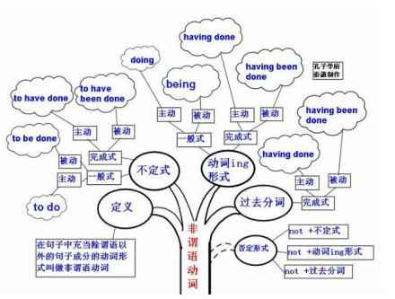

作者：英语老师 Monica 链接：https://www.zhihu.com/question/30030877/answer/768501967

来源：知乎 著作权归作者所有。商业转载请联系作者获得授权，非商业转载请注明出处。

首先，大家要清楚学习语法的目的是什么。说白了是为了造句子，看懂句子，语法就是句子排列的规则。

而为什么学英语的同学们总是挣扎在语法的苦海里，到底是苦海无边，还是因为大家根本没有真正认真去了解过语法的精髓，
只是在无限重复以下错误做法？看看下图你有没有中招：

而真正高效的学习语法的姿势就是，抓重点。我们不是语法专家，不需要面面俱到，把 have 的几十个短语都背下来；
况且，就算你全背下来，也很难全部学会用法。一句话，把语法当成字典背，你就输了。

语法是有逻辑，有框架的。英语语法的框架可以用一个公式来表达：

**英语句子= 主干+修饰成分一.**

主干就是英语中五大句型（简单句)
，简单句就是只有一套主谓结构。

1. 主谓(一个句子最不可或缺的两个部分）：You jump；I jump.

2. 主谓宾（宾语是主语动作的对象)：I love him.

3. 主谓宾（人）宾（物）：please do me(人） a favor（物）.

检验是否是双宾语句型的原则：两个宾语可以调换位置，增加相应介词 to/for please do a favor for me

4. 主谓宾补（补充说明宾语）：I found the book easy

(the book 是 found 的对象，easy 是用来修饰 the book 的)

检验是否是宾补句型的原则：宾语和补语之间加一个系动词，可以构成语义通顺的句子 the book is easy

5. 主系表（说明主语的状态特点）：She is pretty.

一定要记住，英语黄金思维法则第一条——**动词构成了一个句子的骨架结构**

因为动词决定了一个句子是否有宾语，有几个宾语以及其他句子成分。

我为大家整理了几个例句，帮助大家更好地理解简单句几个句型：

二.
任何高阶复杂的句子都是从这五种简单句型演化而来。五种基本句型，是解读英语句子和构造英语句子的基础。

英文中各种复杂句子均是由这五种基本句型扩大、组合、省略或倒装等各种形式变化而来。

简单句没有什么句序的调整，所以翻译起来基本没有什么难度。 但是如果都是这五大简单句型的句子，我们也就不会觉得语法难了。

如果你在英文写作中全部使用这几种简单句型，显示不了英语水平，
有时也很难在应试中取悦阅卷老师，也就是我们说的提升不了文章的逼格。
所以，我们就是要找出让我们看不懂句子的罪魁祸首——句子中的修饰成分。

英语中的修饰成分，分**定语**和**状语**两种情况。

两种修饰成分：

- 修饰名词叫定语——修饰限定名词。
- 修饰其他词的叫状语——把句子「壮大」。

下面介绍第一种修饰成分，定语——修饰限定名词。

定语的修饰，分下面四种情况：

分别举例子：

形容词：She is a lovely girl. 她是一位可爱的女孩。

定语从句：New York is the place that he would like to visit. 纽约是他想去游览的地方。

介词短语：The girl in red is my sister. 穿红色衣服的那个女孩，是我的妹妹。

非谓语动词：the girl standing there=the girl who is standing there. 站在那的女孩。

the building completed yesterday=the building that was completed yesterday. 昨天竣工的楼房

I have something to say= I have something that I want to say. 我还有些要说的话。

从上面非谓语例句可以看到，非谓语动词通常可以变成定语从句。

接下来讲状语。

状语——功能是扩大句子，把句子变复杂，即所谓的长难句。
它有以下几种形式：

名词: come this way.

副词: speak politely.

介词短语：Can you say it in English？

状语从句：I enjoyed myself **when I visited my friends in Shanghai last year.**

非谓语动词：**Having finished the homework**, I went home.

**Given more time**, I could write the essay better.

**To give the teacher a good impression**, I decided to help her.

最后，再介绍英语黄金思维法则第二条——如果要表达多个动作概念：有三种方式

1. 使用连词
2. 使用非谓语动词
3. 使用从句
   

我给大家举一个长难句，并带大家分析本句的句子结构大家就明白了——

例句：There are many lovers become strangers finally

此句是错误的，因为一个句子只能有一个动词，这里面有两个动词，所以另外一个动词就需要变一下形式。

那该如何改呢？根据上面的情况，可以有三种改法。

1. There are many lovers and they become strangers finally(并列连词 and）
2. There are many lovers **who become strangers finally**(从句）
3. There are many lovers **becoming strangers finally**(非谓语动词）

主干和修饰成分讲完了，该实战演练了，下面给出一句考研英语中的句子。

你会发现原来考研英语的句子也可以这么简单看懂例句：

During the past generation,
the American middle-class family that once could count on hard work and fair play to keep itself financially secure has been
transformed by economic risk and new
realities.

大家直接按步骤就能看懂。

注：本文是英语语法干货中的干货，是语法最精髓的要义。
要读懂一个英文句子，希望大家能够做到，
先拆分句子结构，剔除修饰成分，拎出本句的谓语动词和简单句骨骼。
再逐个翻译修饰成分，并组成完整的句意。
